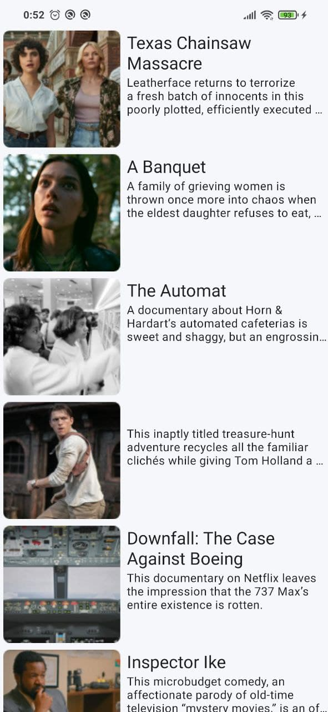
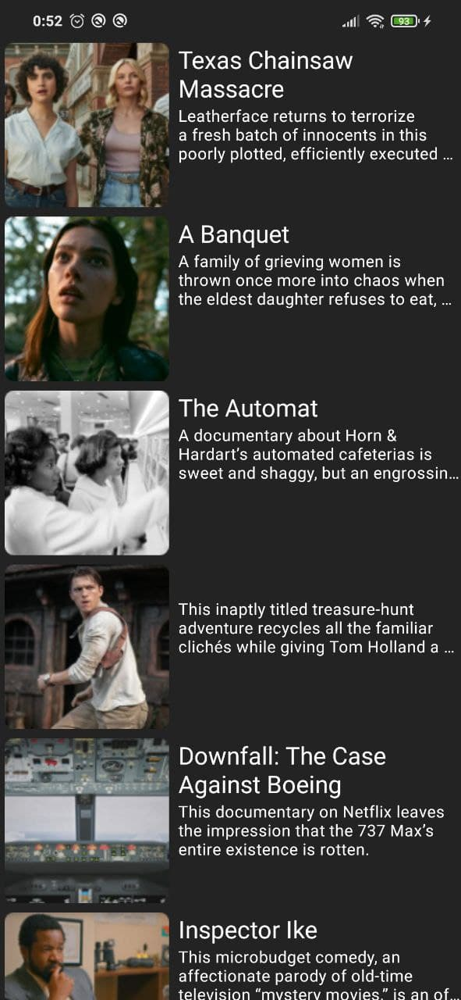

<h1 align="center">MovieReviews - Тестовое задание</h1>

Технологии: Clean, Kotlin, Coroutines, Flow, Hilt, Paging Library, Retrofit

# Краткое описание

Загружает и отображает список обзоров на фильмы. Подгрузка осуществляется постранично по мере прокрутки списка. При свайпе вниз список список перезагружается заново. Во время начальной загрузки или подгрузки данных, отображается прогресс бар. В случае ошибки отображается сообщение об ошибке и кнопка "Повторить".

# Скриншоты

    
    
    

    
    
    

